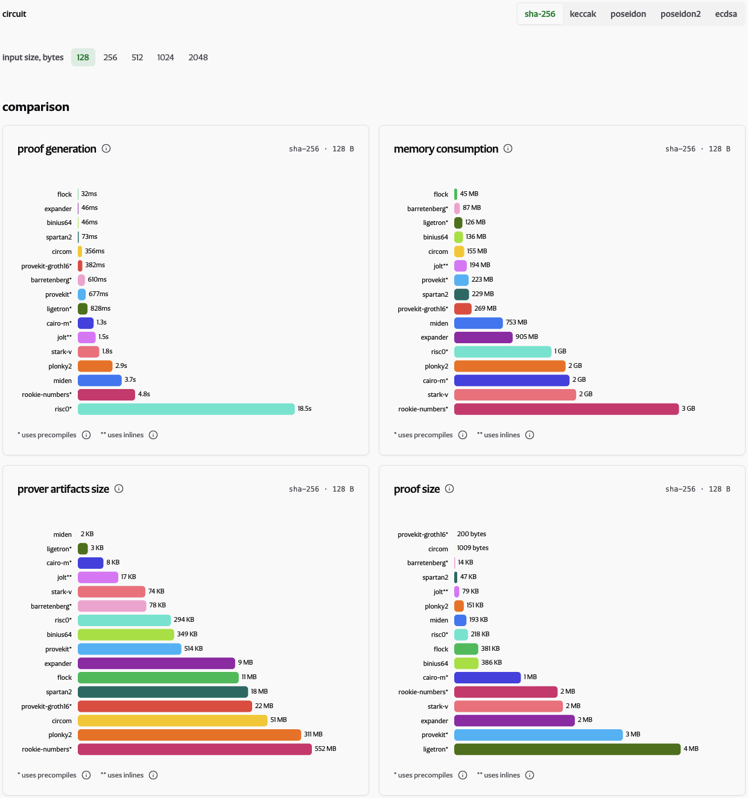
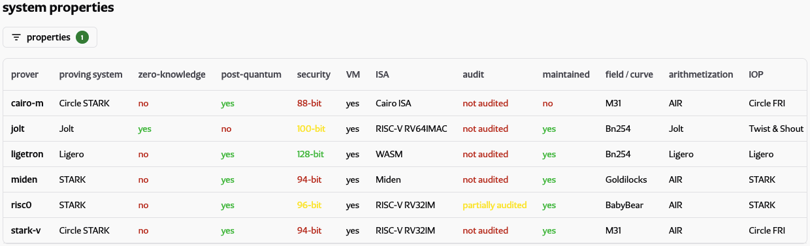
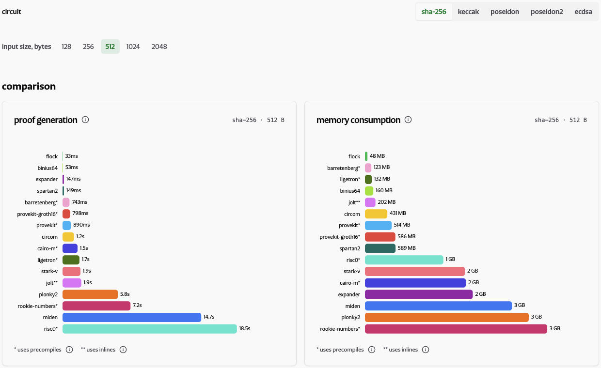
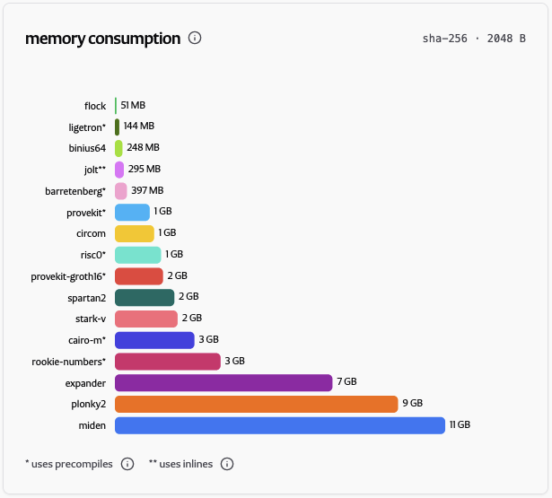
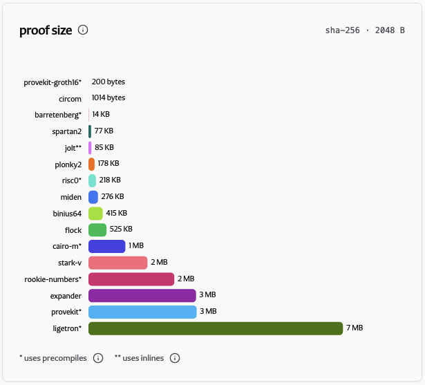
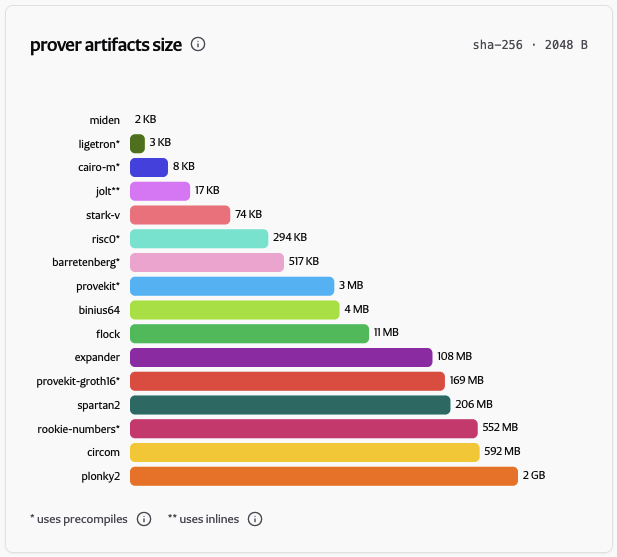
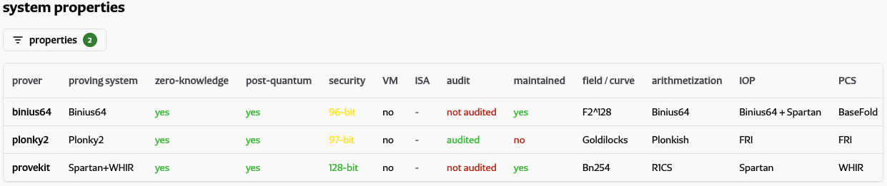

<!-- Ghost title: Client-Side Proving Benchmarks: CROPS, Post-Quantum, and the Missing Middle -->

_Only 3 of 16 benchmarked SNARKs and VMs are both ZK and PQ, and none are simultaneously audited, maintained, and configured to provide at least 100 bits of security._

Right now, no entry in the benchmark combines everything we want for a privacy-preserving, future-proof Ethereum dApp. That combination is the “missing middle” in this post’s title. The measurements support two broad conclusions. First, multiple systems can already support practical client-side proving, so performance is no longer their main obstacle. Second, the three ZK+PQ systems still lack important properties: Binius64 and Plonky2 are configured below 100 bits of security, Binius64 and ProveKit have not been audited, and Plonky2 is no longer maintained. None currently has practical EVM verification, a shared gap that protocol-level STARK aggregation may eventually close. The results also reveal more specific patterns in peak RAM, proof size, and prover artifacts.

## Why client-side proving is important

The recent EF mandate sets the goal of keeping Ethereum Censorship-Resistant, Open-source, Private, and Secure (CROPS).[^ef-mandate] Client-side proving supports two of these properties: privacy and censorship resistance.

Proving should happen on the client because naive delegation (e.g., sending plaintext to a prover server or proving in a TEE) introduces a new observer into the protocol. Once proof generation is outsourced, the delegate may learn the user’s private data or metadata, such as access patterns and stable real-world identifiers, that can link the request to the user.

When generating a proof locally, private inputs never leave the user’s device, enabling data privacy. Removing the delegated prover also eliminates a party that could identify the users and delay or refuse proof generation. In this sense, client-side proving supports censorship resistance by removing a potential point of observation and control.

## The bar for client-side proving

Every system in our benchmark meets the open-source requirement in CROPS. Open-source implementations can be independently inspected, allowing the public to evaluate whether they match their specifications and stated security properties. This makes open source an important mechanism for public verifiability.

Measuring performance alone is not enough. We use an intentionally opinionated target: a system must stay within the client’s RAM budget, prove fast enough for its application, provide zero-knowledge, target at least 100-bit security, be maintained and audited, and support practical verification on Ethereum. To be future-proof, it must also be post-quantum.

## What we measured and how to read the numbers

Our latest results (June 2026)[^results-json] were obtained on an AWS mac2.metal[^aws-instance-specs] host with an Apple M1 CPU and 16 GB RAM. We chose it because it is one of the few cloud machines built from ordinary consumer hardware: the M1 is not a server CPU, is no longer especially new, and is architecturally related to mobile chips used in iPhones. Some client-side proving applications also run on desktops, and a prover’s RAM footprint changes little between desktop and mobile, so these measurements already show whether it is likely to fit on a phone.

The full interactive results are available on the [client-side proving benchmark dashboard](https://ethproofs.org/csp-benchmarks). The figures below are snapshots of that dashboard.

_Figure 1 — Client-side proving benchmark dashboard_

### Benchmark dimensions

For client-side proving, the relevant limits are the user’s hardware, storage, and network connection. Phones are the most constrained target, so a proof system should run on modest hardware and over a metered mobile network. The five measurements that matter most, roughly in order, are peak memory, proving time, prover artifact size, proof size, and verification time. Lower is better for each.

- Peak memory. According to our prior research, an average smartphone has approximately 4 GB of RAM.[^average-mobile-hardware] The usable amount is smaller because the operating system and other apps run at the same time. We use 4 GiB as the cutoff: systems that exceed it on every tested workload fail the memory requirement, while systems that exceed it only on larger inputs remain in the results.
- Proving time. Proving times on the order of tens of seconds can harm the interactive user experience. However, in low-throughput applications such as anonymous credentials, where a user proves something only occasionally, the difference between tens and hundreds of milliseconds may matter less compared to memory, storage, or bandwidth. This leaves some room to trade proving speed against the other dimensions.
- Prover artifact size. Depending on the system, this may be a proving key, compiled program, serialized public setup, or circuit data. Regardless of the artifact’s function, the measurement tells an app developer how much prover-specific data must be downloaded and stored. Large artifacts matter when users have limited storage or metered connectivity and cannot be assumed to have Wi-Fi or an unlimited data plan.
- Proof size. Proof size matters when proofs are transmitted over metered mobile networks.
- Verification time. This is usually the easiest dimension to trade against the others because a server verifier is less constrained than the client prover.

Proof size and verification time can serve as rough proxies for on-chain verification cost. They also give a first indication of recursion cost because an outer prover must process the inner proof and prove the execution of its verifier. However, the recursive verifier’s arithmetization and implementation can dominate the actual cost.

### Benchmark workloads

We benchmark the following circuits and guest programs:

- SHA-256 preimage knowledge proof (message sizes from 128 B to 2048 B). SHA-256 is widely used in existing digital credentials, so it naturally appears in ZK ID applications. It is challenging for many proof systems because its bitwise operations are not friendly to the prime fields over which SNARKs operate.
- Keccak-256 preimage knowledge proof (for the same message size range as SHA-256). Keccak-256 is the EVM’s native hash function, so it is used in ZK applications that need to prove EVM execution and state, including zkEVM and account-ownership proofs. It presents similar arithmetization challenges as SHA-256.
- ECDSA signature verification proof (over a 256-bit digest). ECDSA signatures are widely used in existing digital credentials and in Ethereum itself, so they appear in ZK ID and zkEVM applications. The proof system’s native field usually differs from the fields used by the ECDSA curve. As a result, non-native modular arithmetic and elliptic-curve scalar multiplication are challenging to arithmetize inside a circuit.
- Poseidon and Poseidon2 hash function proofs that hash N input field elements into one output, with N ∈ {2, 4, 8, 12, 16}. The Poseidon family was designed for SNARKs and operates on field elements rather than bits. It is widely used in ZK-native applications such as shielded pools and mixers, where the choice of hash function is not limited to conventional cryptographic primitives. Despite being ZK-friendly, these hashes can still become a computational bottleneck in a circuit.

### Interpretation rules

Some measurements are marked as using a precompile, which refers to a hand-crafted implementation of the target primitive rather than one generated by compiling user code via the system’s standard pipeline. From the developer experience perspective, if a system achieves comparable performance without a precompile, the developers can compile and prove their code efficiently using the system’s standard pipeline, without requiring custom engineering for each primitive.

In many cryptographic schemes, adding ZK incurs performance overhead, so the non-ZK numeric results should be interpreted with caution. Non-ZK systems can still be useful as components or points of comparison.

We also avoid using "zkVM" as a blanket term, as its use in the ecosystem often blurs the distinction between the two properties. We split them into two columns: "zero-knowledge" and "VM".

_Figure 2 — System properties table filtered by the "VM" property. Only Jolt is fully ZK._

Security estimates below 96 bits are shown in red. For perspective, by late 2025 Bitcoin miners had cumulatively performed an estimated 2⁹⁶ proof-of-work hash attempts over the network’s lifetime.[^bitcoin-hashrate] Although this is not a direct measure of the cost of attacking a proof system, it shows that computation at the 2⁹⁶ scale has already been carried out in practice. We therefore do not regard sub-96-bit estimates as providing a comfortable security margin.

## Findings

### Client-side proving is already practical

With 4 GiB of RAM and 10 seconds of proving time as practical cutoffs, nine of the 16 systems stay within both limits on every workload they ran: Flock, ProveKit, Barretenberg, Binius64, Cairo-M, Spartan2, Jolt, Stark-V, and Rookie Numbers. Twelve systems stay within both limits on the largest SHA-256 workload. However, coverage differs substantially: Barretenberg and ProveKit meet both limits on all 21 workloads, while several other systems cover only one or two targets.

In cases like Binius64 and Flock, this narrower coverage is natural, because both systems use binary-field arithmetizations which benefit proving bitwise operations (abundant in SHA-256 and Keccak). That specialization also limits their versatility: their strong results on conventional hashes should not be generalized to workloads with heavy elliptic-curve or prime-field arithmetic, such as Poseidon or ECDSA.

_Figure 3 — Proving times and RAM footprints for the SHA-256 512 B input benchmark_

The tradeoff one might fear most for client-side proving—proving time against prover RAM—does not appear in these results. Instead, low RAM use and fast proving generally occur together: Flock, Binius64, and Barretenberg perform especially well on both metrics, while systems with the highest peak RAM also tend to take longer to prove.

### Peak RAM reflects the SNARK architecture

The clearest memory pattern appears on SHA-256. Systems that keep full execution traces and expanded evaluation domains in memory during proving, such as Cairo-M, Miden, Plonky2, RISC Zero, Rookie Numbers, and Stark-V, use substantially more RAM than the other systems. The same pattern appears more weakly on Keccak. Flock, Binius64, Barretenberg, Jolt, Ligetron, ProveKit, and Spartan2 avoid this particular source of memory growth and generally use less RAM.

_Figure 4 — RAM footprints for the SHA-256 2048 B input benchmark_

### Commitment schemes affect proof size

Hash-based SNARKs produce larger proofs in this benchmark because their proofs carry multiple Merkle openings. Pairing and discrete-log commitments aggregate polynomial openings more compactly: the two Groth16 entries produce proofs of roughly 200 bytes to 1 KB, Barretenberg roughly 14 KB, and Jolt roughly 80 KB, while hash-based systems more often produce proofs in the hundreds of kilobytes or megabytes.

_Figure 5 — Proof sizes for the SHA-256 2048 B input benchmark_

### The largest prover artifacts come from circuit-specific setup and preprocessing

On their largest measured workloads, Plonky2 reports 2.36 GiB of prover data, Circom 1.25 GiB, ProveKit-Groth16 764 MiB, Rookie Numbers 552 MiB, and Spartan2 206 MiB. These systems persist circuit-specific proving keys, circuit data, or other preprocessed state. At these sizes, distributing the prover data can be a major client constraint even when proving stays within the RAM and time limits.

_Figure 6 — Prover artifact sizes for the SHA-256 2048 B input benchmark_

### No ZK+PQ system yet meets the full target

Only eight of the 16 benchmark entries are zero-knowledge. Eleven are marked post-quantum. Only three are both: Binius64, Plonky2, and ProveKit. None of those three is simultaneously maintained, audited, and configured for at least 100 bits of security. Binius64 is maintained but not audited and is configured at 96 bits. Plonky2 is audited and configured at 97 bits but is not maintained. ProveKit is maintained and configured at 128 bits but has not yet been audited. This may change as the projects evolve.

_Figure 7 — System properties table filtered by the "ZK" and "PQ" properties_

Barretenberg and Binius64 illustrate opposite sides of the gap. Barretenberg is Aztec’s cryptography backend, and it has no obvious weak point in the measured results: a median peak memory of roughly 92 MB, a worst-case proving time of 6.3 seconds, 14 KB proofs, a median verification time of about 19 ms, and small prover artifacts. However, it misses the full bar because it is not post-quantum. Binius64 is ZK, post-quantum, fast, and uses little RAM, but it is configured for 96-bit security and has not been audited.

Security estimates can change when new research invalidates an assumption. Recent Reed–Solomon proximity-gap results have shown that some conjectured parameter choices for hash-based SNARKs are unsafe and that using parameters supported by proven bounds can increase proof size and verification time.[^proximity-gaps] For FRI-based systems in particular, the reported security estimate should be read together with the assumptions and parameters used to calculate it.

Post-quantum soundness is already a concern for Ethereum.[^pqeth] But the three entries that combine ZK and post-quantum security face another gap: none currently has a practical EVM verifier.

## What this means for builders

Builders currently face three compromises:

- A builder shipping today can choose a strong classical system with good client-side performance and practical EVM verification, but gives up PQ security.
- A builder treating PQ as a hard requirement must currently accept some combination of missing ZK, missing audits or tooling, weaker parameters, and no practical on-chain verification.
- A builder that needs general-purpose VM execution must trade among ZK, performance, post-quantum soundness, and portability: none of the VM entries is simultaneously ZK, post-quantum, fast enough for client-side proving, and based on a widely supported ISA such as RISC-V.

These compromises are not the only engineering differences. Some systems support high-level circuit languages or guest programs in general-purpose languages; others only provide a custom circuit API or low-level assembly. AI agents may reduce some of this developer experience burden, but it still matters for human audit.

## What comes next

The on-chain verification gap for post-quantum proofs may be temporary. The current Lean Ethereum strawmap places protocol-level STARK aggregation in the proposed L\* fork in 2029.[^lean-strawmap] Draft EIP-8288 specifies this path: transactions would declare STARK proofs as dependencies, which would be combined into a recursive STARK and checked by the protocol.[^eip-8288] If it ships, applications using those supported proofs would no longer need to run a verifier inside EVM smart contracts.

In the meantime, this benchmark effort is ongoing and open. The harness, inputs, and methodology live in the public repository, and adding a system or a target is as easy as submitting a pull request.[^csp-benchmarks-repo] We especially hope the maintainers of the systems we measure will keep their entries current—both the performance numbers and the system properties (ZK, PQ, security bits, audit and maintenance status) that this kind of analysis depends on. If you maintain a proving system or want to add one, the contributing guide is the place to start.

The ultimate goal is to make client-side proving routine: private, censorship-resistant, open, secure, and post-quantum. The benchmark shows that the client-performance part is already achievable. The remaining work is to combine it with ZK, post-quantum soundness, at least 100-bit security, a maintained and audited implementation, and practical Ethereum verification.

## Acknowledgements

We are most grateful to the Ethproofs team for building and hosting the interactive benchmark dashboard and for publishing this post. Thanks to Brechy for preparing an early version, and to Andy and Nam for feedback.

## References

[^results-json]: Client-Side Proving Benchmarks, June 2026 results, https://github.com/privacy-ethereum/csp-benchmarks/blob/main/results/collected_benchmarks_26644954256.json

[^csp-benchmarks-repo]: CSP benchmarks source code, https://github.com/privacy-ethereum/csp-benchmarks.

[^ef-mandate]: Ethereum Foundation Blog, The Promise of Ethereum: Introducing the EF Mandate, https://blog.ethereum.org/2026/03/13/ef-mandate.

[^average-mobile-hardware]: Client-Side Proving, Average Mobile Hardware Survey, https://hackmd.io/@clientsideproving/AvgMobileHardware

[^proximity-gaps]: ZK/SEC Quarterly, Proximity Gaps: What Happened and How Does It Affect Our SNARKs, https://blog.zksecurity.xyz/posts/proximity-conjecture/.

[^pqeth]: Post-Quantum Ethereum, https://pq.ethereum.org/

[^lean-strawmap]: EF Protocol, L1 Strawmap, https://strawmap.org/.

[^bitcoin-hashrate]: Vitalik Buterin, Bitcoin hashrate and 96-bit security margin: https://x.com/VitalikButerin/status/1996954146604204363.

[^eip-8288]: Ethereum EIPs, Add EIP: Frame type for PQ sig and STARK aggregation, https://github.com/ethereum/EIPs/pull/11772.

[^aws-instance-specs]: AWS instance specs, https://aws.amazon.com/ec2/instance-types/mac/
